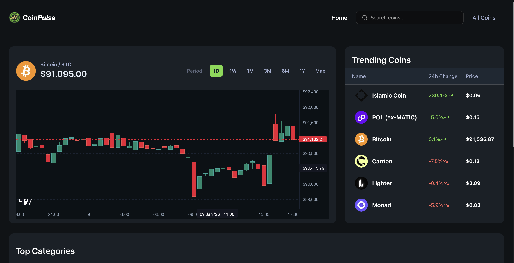

<div align="center">
  <br />
        <div>
      
    </div>
  <br />

  <div>


  </div>

  <h3 align="center">CoinPulse — Analytics Dashboard for Web3</h3>


## <a name="introduction">✨ Introduction</a>

CryptoPulse is a high-performance analytics dashboard built with Next.js 16, TailwindCSS v4, and shadcn/ui, delivering real-time market intelligence via CoinGecko’s API and WebSockets. It features high-frequency price tracking and live orderbook streams for low-latency updates, paired with interactive TradingView candlestick charts to visualize OHLCV data with surgical precision. From a dynamic homepage showcasing global stats and trending assets to robust token pages with multi-fiat converters and advanced search tables, the platform provides a modular, developer-friendly stack optimized for speed and clarity.

If you're getting started and need assistance or face any bugs, join our active Discord community with over **50k+** members. It's a place where people help each other out.

<a href="https://discord.com/invite/n6EdbFJ" target="_blank"></a>

## <a name="tech-stack">⚙️ Tech Stack</a>

- **[Next.js]
- **[TypeScript]
- **[Tailwind CSS]
- **[Shadcn/ui]

## <a name="features">🔋 Features</a>

👉 **Home Dashboard**: Displays crucial market health indicators like **Total Market Cap** and **BTC & ETH dominance**, alongside a dynamic list of **Trending Tokens**, all retrieved instantly using the CoinGecko `/global` and `/search/trending` endpoints.

👉 **Token Discovery Page**: A comprehensive, sortable and searchable table featuring key token metrics (Price, 24h change, Market Cap Rank) for mass market analysis, powered by the scalable `/coins/markets` REST API and optimized with pagination for efficient browsing.

👉 **Detailed Token Overview**: Provides an immediate summary of any selected token, including its logo, current price, and market cap rank, utilizing the `/coins/{id}` REST API for core data and the **CGSimplePrice WebSocket** for continuous, live price monitoring.

👉 **Interactive Candlestick Chart**: Integrates **TradingView Lightweight Charts** to visualize market trends and price action with surgical precision, rendering multi-timeframe OHLCV data fetched from CoinGecko’s high-performance market endpoints.

👉 **Real-Time Trades & Orderbook**: Features a live stream of market activity exactly as it happens on the exchange, using low-latency WebSockets to display a constant flow of buy/sell orders and recent trade executions.

👉 **Smart Currency Converter**: An interactive tool that allows users to instantly compute coin amounts into dozens of supported fiat and crypto currencies, leveraging the `/simple/supported_vs_currencies` and `/simple/price` endpoints for accurate conversions.

👉 **Exchange & Trading Pairs**: Allows users to analyze trading context by displaying aggregated lists of exchanges and available trading pairs, with all data sourced directly from the dedicated `/exchanges` and `/exchanges/{id}/tickers` REST APIs.

👉 **Global Search Functionality**: A powerful, unified search bar that allows users to quickly locate any crypto asset by name or symbol, linking directly to the respective Token Detail Page via the CoinGecko `/search` and `/coins/{id}` REST endpoints.

And many more, including code architecture and reusability.

## <a name="quick-start">🤸 Quick Start</a>

Follow these steps to set up the project locally on your machine.

**Prerequisites**

Make sure you have the following installed on your machine:

- [Git](https://git-scm.com/)
- [Node.js](https://nodejs.org/en)
- [npm](https://www.npmjs.com/) (Node Package Manager)

**Cloning the Repository**

```bash
git clone  https://github.com/Anshuman-Jha/CoinPulse.git
cd CoinPulse
```

**Installation**

Install the project dependencies using npm:

```bash
npm install
```

**Set Up Environment Variables**

Create a new file named `.env` in the root of your project and add the following content:

```env
COINGECKO_BASE_URL=https://pro-api.coingecko.com/api/v3
COINGECKO_API_KEY=

NEXT_PUBLIC_COINGECKO_WEBSOCKET_URL=
NEXT_PUBLIC_COINGECKO_API_KEY=
```

Replace the placeholder values with your real credentials. You can get these by signing up at: [**CoinGecko API**](https://jsm.dev/crypto-gecko).

**Running the Project**

```bash
npm run dev
```

Open [http://localhost:3000](http://localhost:3000) in your browser to view the project.


