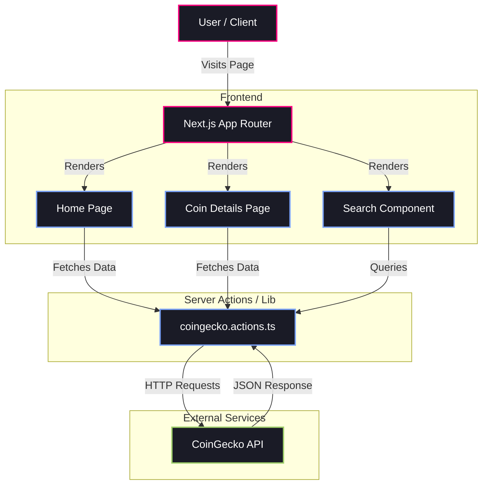

<div align="center">
  <br />
        <div>
      
    </div>
  <br />

  <div>


  </div>

  <h3 align="center">CoinPulse — Analytics Dashboard for Web3</h3>


## <a name="introduction">✨ Introduction</a>

Experience the pulse of the crypto market in real-time. **CoinPulse** isn't just a dashboard; it's your high-frequency command center for Web3 intelligence. Built on the bleeding edge with **Next.js 16**, **Tailwind v4**, and **CoinGecko's Pro API**, we deliver sub-second market updates, live orderbook streams, and surgical-grade charting powered by TradingView. Whether you're tracking global dominance or hunting the next moonshot, CoinPulse gives you the unfair advantage of speed, clarity, and precision.

### System Architecture


## <a name="features">🔋 Features</a>

**🚀 Mission Control Dashboard**
Instant access to global market health. Track Market Cap, Dominance, and Trending Coins in real-time.

**💎 Token Explorer**
Filter, sort, and discover hidden gems among thousands of assets with our high-performance table.

**⚡ Live Market Pulse**
Witness the market move dynamically. Real-time price updates and live orderbook streams via WebSockets—no refreshing needed.

**📈 Pro-Grade Charting**
Technical analysis made beautiful. Interactive TradingView charts with multi-timeframe OHLCV data.

**� Smart Currency Converter**
Seamlessly calculate value across dozens of fiat and crypto currencies instantly.

**🔍 Universal Search**
Find any asset in milliseconds with our optimized global search.

**🏦 Deep Market Analysis**
Explore exchanges, trading pairs, and tickers to understand the full liquidity landscape.

## <a name="tech-stack">⚙️ Tech Stack</a>

- **[Next.js]
- **[TypeScript]
- **[Tailwind CSS]
- **[Shadcn/ui]
- **[CoinGecko API]
TradingView Lightweight Charts

## <a name="quick-start">🤸 Quick Start</a>

Follow these steps to set up the project locally on your machine.

**Prerequisites**

Make sure you have the following installed on your machine:

- [Git](https://git-scm.com/)
- [Node.js](https://nodejs.org/en)
- [npm](https://www.npmjs.com/) (Node Package Manager)

**Cloning the Repository**

```bash
git clone  https://github.com/Anshuman-Jha/CoinPulse.git
cd CoinPulse
```

**Installation**

Install the project dependencies using npm:

```bash
npm install
```

**Set Up Environment Variables**

Create a new file named `.env` in the root of your project and add the following content:

```env
COINGECKO_BASE_URL=https://pro-api.coingecko.com/api/v3
COINGECKO_API_KEY=

NEXT_PUBLIC_COINGECKO_WEBSOCKET_URL=
NEXT_PUBLIC_COINGECKO_API_KEY=
```

**Running the Project**

```bash
npm run dev
```

Open [http://localhost:3000](http://localhost:3000) in your browser to view the project.


